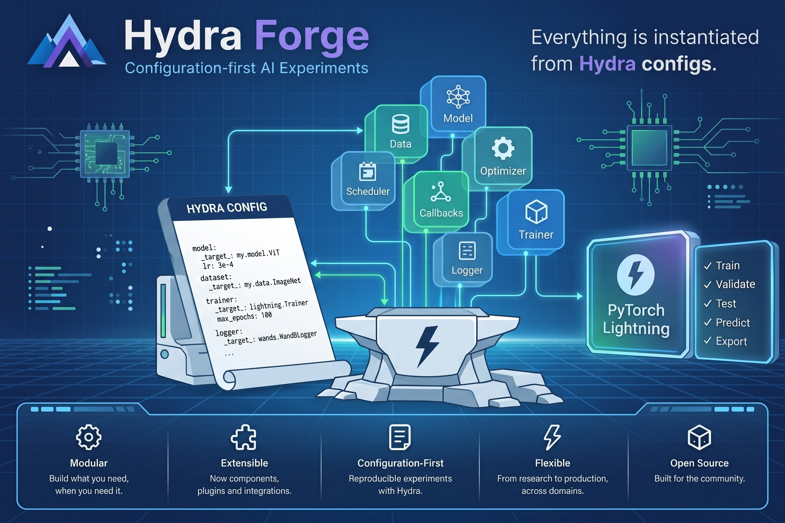

# Hydra Lightning Forge

Forge reproducible AI experiments.



Hydra Lightning Forge is a lightweight project scaffold for building configurable machine learning experiments with Hydra and PyTorch Lightning. It is designed to make experiment setup explicit, reproducible, and easy to extend.

## 🎯 Core Philosophy: Everything is Instantiated from Hydra Configs

In standard deep learning codebases, component wiring such as: **model architectures**, **loss functions**, **metrics**, **optimizers**, **datasets**, **data splitters**, and **callbacks** is frequently hardcoded inside Python script boilerplate. 

**Hydra-Lightning Forge (`hlforge`) adopts a clear, unifying philosophy: *"Everything is instantiated from Hydra configs."***

By using `hydra.utils.instantiate` managed through `hlforge.ExperimentForge.assemble()`, the YAML configuration file becomes the declarative blueprint and single source of truth for your entire machine learning pipeline:

- **Models & Submodules**: Dynamic composition of backbones, heads, and encoders/decoders via `hlforge.CompositeModel`.
- **Datasets & Preprocessing**: Declarative datasets (e.g., `torchvision.datasets.MNIST`), data transformations (`torchvision.transforms`), and modular splitters (`hlforge.RandomSplitter`).
- **Training & Optimization**: Loss criteria (`torch.nn.CrossEntropyLoss`, `torch.nn.MSELoss`), custom loss wrappers (`MseLossWrapper`), optimizers (`torch.optim.Adam`), and schedulers (`LRSchedulerConfig`).
- **Evaluation Metrics**: Metric collections (e.g., `torchmetrics.classification.MulticlassAccuracy`) attached seamlessly across training, validation, and testing steps.
- **Callbacks & Loggers**: Custom visual evaluation callbacks (e.g., `ImageSampler`), model checkpointing (`ModelCheckpoint`), and logging backends (`CSVLogger`).
- **Lightning Trainer**: Full `pytorch_lightning.Trainer` configuration including accelerators, devices, and execution flags (`fast_dev_run`, `overfit_batches`).

If a component can be configured, it can be instantiated allowing you to alter model architectures, dataset parameters, or training routines purely by modifying configuration files without altering underlying source code.

## Key features

- **Philosophy of Total Instantiation**: Build models, datamodules, optimizers, and callbacks directly from Hydra YAMLs.
- **Configuration-driven experimentation** powered by Hydra.
- **PyTorch Lightning pipeline automation** via `hlforge.BaseLightningModule` and `hlforge.BaseLightningDataModule`.
- **Clean separation** between configuration, core `hlforge` abstractions, and example pipelines.
- **Dependency group isolation** (`hlforge` core vs `examples` with PyTorch CUDA 12.6 wheels).
- **Reproducible experiment runs** with structured CLI execution via `hlforge-train`.

## Installation and Dependency Groups

This project uses `pyproject.toml` with `uv` for fast, reproducible dependency management. Dependencies are split into core requirements (`hlforge`) and example requirements (`examples` with PyTorch CUDA 12.6 wheels).

### How to use each group

- **Sync/Install main package only**:
  ```bash
  uv sync --no-default-groups
  ```

- **Sync/Install including the all groups, ie, dev and examples group (CUDA 12.6 wheels)**:
  ```bash
  uv sync --all-groups
  ```

- **Sync/Install including the examples group (CUDA 12.6 wheels)**:
  ```bash
  uv sync --group examples
  ```

- **Run an experiment using the CLI**:
  ```bash
  # Example for raw PyTorch Lightning:
  hlforge-train --config-path "$PWD/src/examples/pl_basics/pl_modules/ex_01_backbone_image_classifier" --config-name config
  
  # Example for Hydra-Lightning Forge:
  hlforge-train --config-path "$PWD/src/examples/pl_basics/hl_forge_modules/ex_01_mnist" --config-name config
  ```

## How to consume hlforge?

Once `hydra-lightning-forge` is published to PyPI, you can consume it as a library in downstream projects.

### Installation

Install via `pip`:
```bash
pip install hydra-lightning-forge
```

Or add it using `uv`:
```bash
uv add hydra-lightning-forge
```

### PyTorch & CUDA Compatibility

`hlforge` is designed to be hardware- and environment-agnostic:

* **Flexible PyTorch & CUDA Versions**: `hlforge` requires `pytorch-lightning>=2.5.5` in its core dependencies without locking `torch` to a specific CUDA build or wheel index. Downstream projects can install and use **any PyTorch version** supported by PyTorch Lightning (typically `torch >= 2.0.0`) alongside **any CUDA toolkit** (e.g., CUDA 11.8, 12.1, 12.4, ROCm, or CPU-only).
* **No Lockfile / Environment Leakage**: Local repo settings (such as `uv.lock` or `[tool.uv.sources]`) only apply when developing inside this repository. They are never published to PyPI or enforced on downstream consumers.

## Project structure

```text
.
├── docs/
│   └── assets/
│       └── hydra_forge.png # Architecture & flow diagram
├── src/
│   ├── hlforge/            # Main package (Hydra + Lightning core logic & CLI)
│   └── examples/
│       └── pl_basics/      # Examples (pl_modules and hl_forge_modules)
├── outputs/                # Run artifacts, Hydra configs, and logs
├── pyproject.toml          # Project configuration & dependency groups
└── README.md
```

## Getting started

1. Install the main package or sync with the `examples` group using `uv sync --group examples`.
2. Explore or add experiment pipelines under `src/examples/`.
3. Train models via the CLI (`hlforge-train`) or run example scripts using `uv run`.

## License

This project is licensed under the Apache License, Version 2.0 (the "License"); you may not use this file except in compliance with the License. You may obtain a copy of the License at

    http://www.apache.org/licenses/LICENSE-2.0

Unless required by applicable law or agreed to in writing, software distributed under the License is distributed on an "AS IS" BASIS, WITHOUT WARRANTIES OR CONDITIONS OF ANY KIND, either express or implied. See the License for the specific language governing permissions and limitations under the License.
